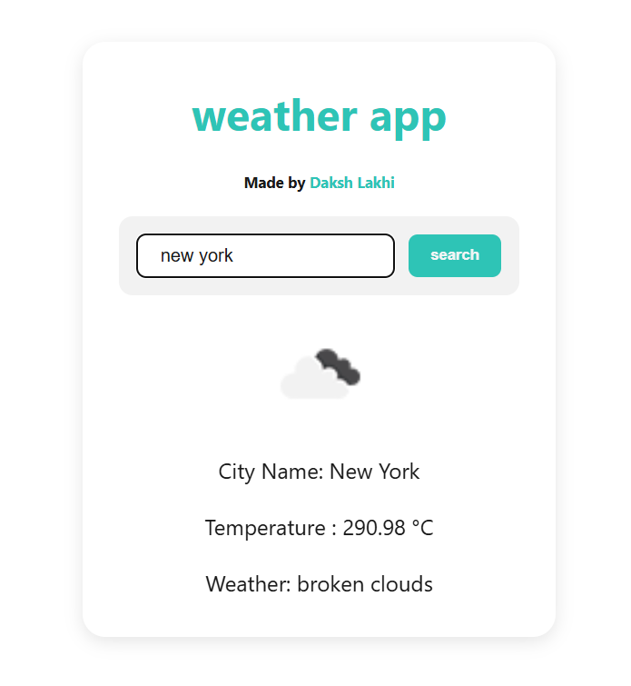

# 🌦️ React Weather App

A sleek, minimal weather app built using **React JS** and the **OpenWeatherMap API**.  
Search for any city and get real-time weather updates instantly!

## 🔗 Live Demo

👉 [Visit the App](https://reactjs-weather-app-dl.netlify.app)

## 📸 Screenshot

  
*Replace this path with your actual screenshot image in the repo*

## ✨ Features

- 🌍 Search weather by city name
- 🌡️ Shows temperature in Celsius
- 🌤️ Displays weather conditions (e.g. Clear, Cloudy, Rainy)
- 💨 Wind speed information
- 🧭 Easy-to-use interface
- 📱 Responsive design for all devices

## 🛠️ Built With

- React JS
- HTML5 & CSS3
- JavaScript (ES6)
- OpenWeatherMap API
- Netlify (for deployment)

## 👨‍💻 Author

**Daksh Lakhi**  

## 📬 Contact

📧 Email: [dakshlakhi01@gmail.com](mailto:dakshlakhi01@gmail.com)  
🔗 GitHub: [github.com/lakhidaksh-01](https://github.com/lakhidaksh-01)
